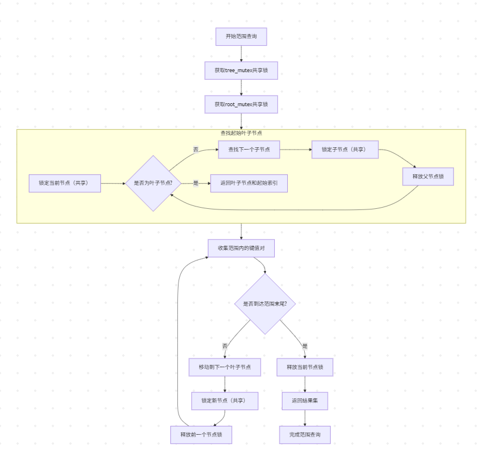
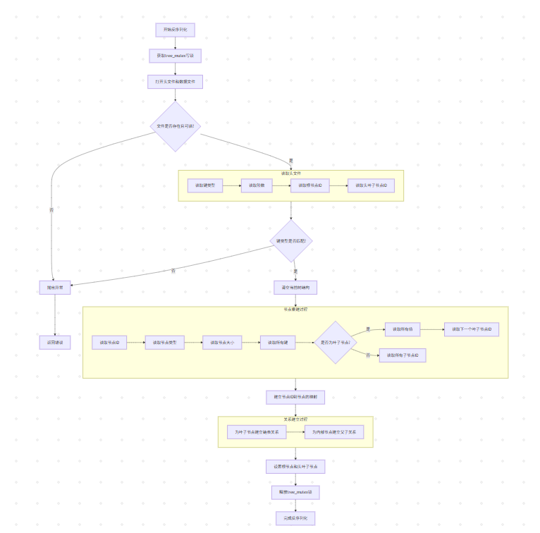

# 并发B+树实现

## 项目概述
这是一个支持并发的B+树实现，具有以下特性：
- 线程安全的插入、删除和查找操作
- 范围查询功能
- 序列化和反序列化支持
- 支持整数和字符串键

类图


插入流程图


查找流程图


删除流程图


范围查找流程图


序列化流程图


反序列化流程图


## 编译说明
```bash
mkdir build
cd build
cmake ..
make
```

## 内存泄漏
```bash
cd build
valgrind --leak-check=full --show-leak-kinds=all --track-origins=yes ./base_function_test
```

## 性能测试
```bash
cd build
sudo perf record -g -F 99 ./base_function_test
sudo perf report
```